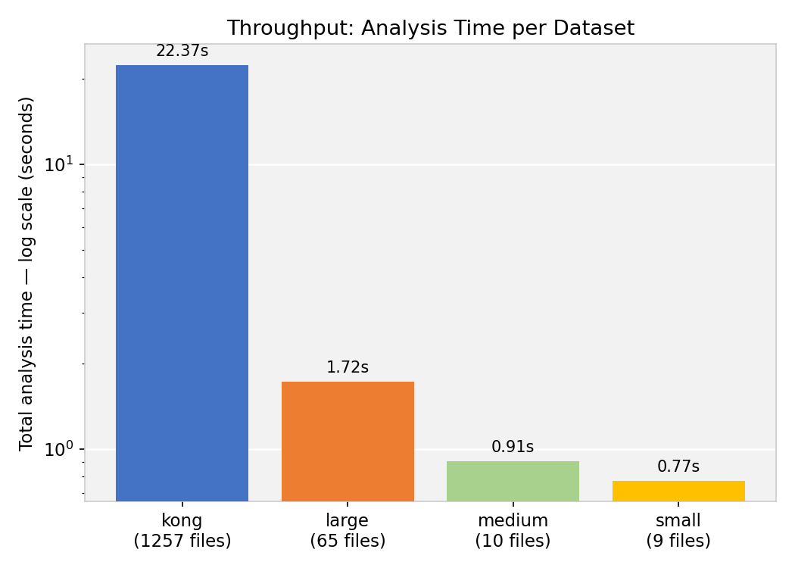
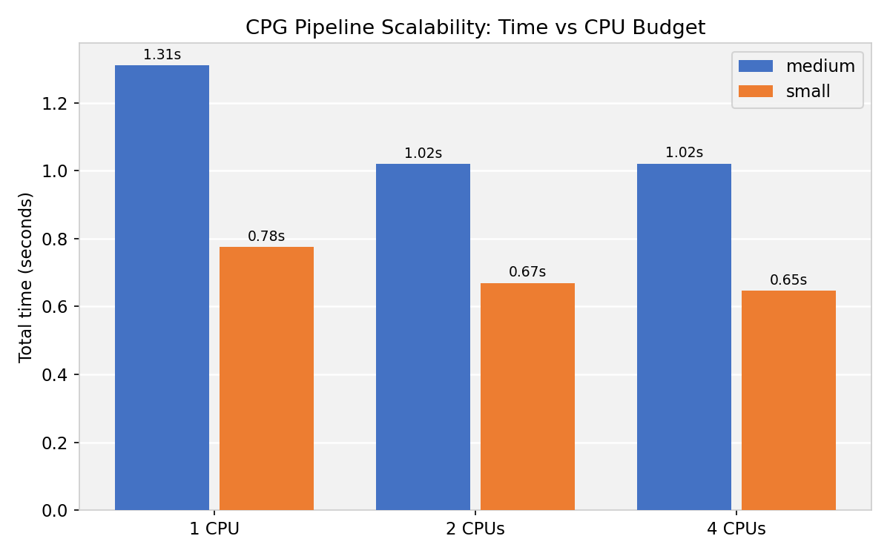
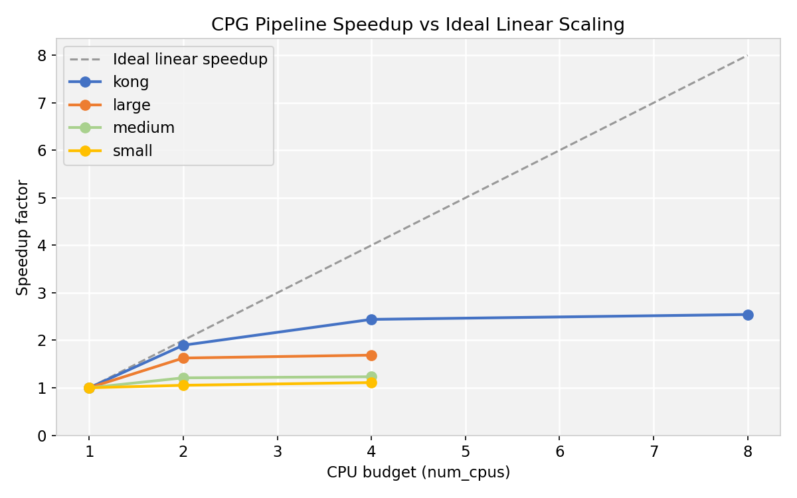
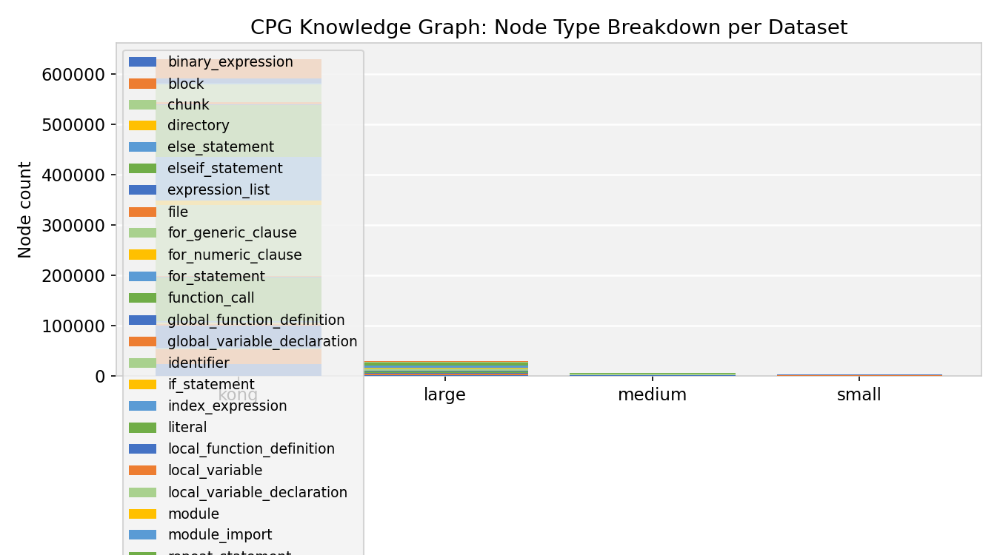
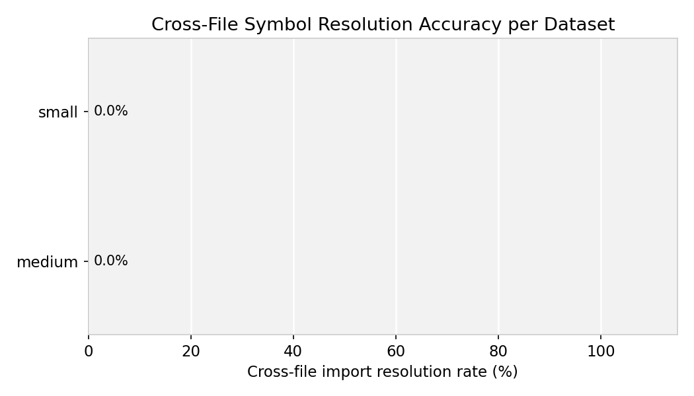

# Výsledky benchmarku — GraphCreator CPG Pipeline

> *Automaticky generovaný report. Posledná aktualizácia: 2026-05-09 13:33 UTC*


---


## 1. Prostredie a metodológia

### 1.1 Hardwarové a softwarové prostredie

| Parameter         | Hodnota                 |
| ----------------- | ----------------------- |
| OS                | Linux 6.17.0-23-generic |
| Procesor          | x86_64                  |
| Logické CPU jadrá | 16                      |
| Python            | 3.11.14                 |
| Ray               | 2.54.0                  |
| Dátum merania     | 2026-05-09              |


### 1.2 Architektúra pipeline

CPG pipeline pozostáva z dvoch hlavných fáz:

1. **Fáza analýzy** — každý `.lua` súbor je spracovaný ako samostatná Ray úloha (`analyze_file.remote`, deklarovaná s `@ray.remote(num_cpus=1)`). Každá úloha zavolá `_analyze_single`, ktorá:
   - parsuje zdrojový kód pomocou **tree-sitter** (AST),
   - vybuduje lokálnu **tabuľku symbolov**,
   - skonštruuje lokálny **CPG podgraf** (AST uzly + hrany, znalostný graf).

2. **Fáza zbierania** — `GraphCollector.collect()` zlúči výsledky všetkých súborov:
   - uloží lokálne výsledky,
   - vytvorí hierarchiu súborového systému (spine),
   - zostaví index modulov,
   - rozlíši medzisúborové importy (`REFERS_TO` hrany),
   - vypočíta metriky grafu a validuje schému.

Deklarácia `@ray.remote(num_cpus=1)` je kľúčová — bez nej Ray neregistruje spotrebu CPU a `num_cpus=N` v `ray.init()` neobmedzuje paralelizmus. S ňou platí: `num_cpus=N` ↔ maximálne N súbežných úloh.


### 1.3 Merané metriky

| Metrika                | Popis                                                                                 |
| ---------------------- | ------------------------------------------------------------------------------------- |
| `time_ray_s`           | Wall-clock čas od odoslania všetkých úloh po dokončenie poslednej                     |
| `time_collect_s`       | Čas fázy zbierania GraphCollector (sekvenčná, po dokončení analýzy)                   |
| `time_total_s`         | `time_ray_s + time_collect_s`                                                         |
| `rss_delta_mb`         | Nárast RSS pamäte hlavného procesu počas celého benchmarku (psutil, nulová réžia)     |
| `avg_parse_s`          | Priemerný čas tree-sitter parsingu na súbor                                           |
| `avg_ast_insert_s`     | Priemerný čas vkladania AST uzlov na súbor                                            |
| `avg_symbol_s`         | Priemerný čas budovania tabuľky symbolov na súbor                                     |
| `avg_cpg_build_s`      | Priemerný čas konštrukcie CPG grafu na súbor — zvyčajne dominantný                    |
| `resolution_rate`      | Podiel úspešne rozlíšených medzisúborových `require()` importov                       |
| `first_result_latency` | Latencia prvého výsledku = Ray scheduling overhead + cold-start workera               |
| `task_spread_s`        | Časové okno medzi prvým a posledným dokončeným súborom (≈ efektívne okno paralelizmu) |


### 1.4 Varianty spustenia

| Variant     | num_cpus | Popis                                                        |
| ----------- | -------- | ------------------------------------------------------------ |
| Ray @ 1 CPU | 1        | Jeden Ray worker — sériové vykonávanie, baseline pre speedup |
| Ray @ 2 CPU | 2        | Dva Ray workeri — dvojnásobná paralelizácia                  |
| Ray @ 4 CPU | 4        | Štyri Ray workeri — štvornásobná paralelizácia               |
| Ray @ 8 CPU | 8        | Osem Ray workerov — maximálna konfigurácia v testoch         |


> **Meranie pamäte:** `tracemalloc` beží v hlavnom procese počas `ray.wait()` — réžia je ~0 (hlavný proces iba čaká, nealokuje). RSS delta sa meria pomocou `psutil.Process().memory_info().rss` (nulová réžia).


### 1.5 Repozitárový benchmark runner (`runner_repos.py`)

Pre benchmarkovanie veľkého počtu repozitárov bol navrhnutý špeciálny runner s **config-outer, repo-inner** slučkou:

```
pre každú num_cpus konfiguráciu:
    inicializuj Ray raz pre túto konfiguráciu
    pre každý repozitár:
        načítaj zoznam súborov
        spusti run_benchmark_on_dir(..., ray_restart=False)
        ulož výsledok do results/repos/
    vypni Ray
```

**Prečo config-outer?** Inicializácia Ray trvá ~2–5 s a po dlhom behu môže Ray cluster akumulovať stav (object store pressure, worker GC lag) a zlyhať. Config-outer loop znamená:

- Ray sa inicializuje **iba 3×** pre 300 repozitárov × 3 CPU konfigurácie (nie 900×)
- Pri zlyhaní Ray clustera počas behu sa automaticky reštartuje (`if not ray.is_initialized(): _start_ray(num_cpus)`) a pokračuje ďalším repozitárom
- Výsledky sú **inkrementálne** — `_already_ran(repo, num_cpus)` skontroluje existenciu JSON súboru a preskočí hotové kombinácie, takže re-run po crash-i pokračuje presne tam, kde sa zastavil

---


## 2. Kong dataset  (1 257 súborov)

Kong je reálny open-source API gateway napísaný v Lua (1 257 `.lua` súborov). Slúži ako hlavný stresový dataset pre meranie škálovateľnosti pipeline.


### 2.1 Prehľad výsledkov

| Variant     | CPU | Súborov | Čas celkom | Speedup vs seq | RSS delta | KG uzly | KG hrany | Rozlíšenie |
| ----------- | --- | ------- | ---------- | -------------- | --------- | ------- | -------- | ---------- |
| Ray @ 1 CPU | 1   | 1257    | 34.654 s   | 1.00×          | 3846.7 MB | 557 017 | 776 637  | 0.0 %      |
| Ray @ 2 CPU | 2   | 1257    | 21.091 s   | 1.64×          | 3198.2 MB | 557 017 | 776 637  | 0.0 %      |
| Ray @ 4 CPU | 4   | 1257    | 14.445 s   | 2.40×          | 3043.5 MB | 557 017 | 776 637  | 0.0 %      |
| Ray @ 8 CPU | 8   | 1257    | 13.112 s   | 2.64×          | 3036.2 MB | 557 017 | 776 637  | 0.0 %      |




### 2.2 Škálovateľnosť Ray

| CPU jadrá | Čas analýzy | Čas zbierania | Speedup | Efektívnosť |
| --------- | ----------- | ------------- | ------- | ----------- |
| 1         | 29.143 s    | 5.511 s       | 1.00×   | 100.0 %     |
| 2         | 15.639 s    | 5.452 s       | 1.64×   | 82.2 %      |
| 4         | 8.945 s     | 5.500 s       | 2.40×   | 60.0 %      |
| 8         | 7.433 s     | 5.679 s       | 2.64×   | 33.0 %      |

> **Efektívnosť** = `speedup / num_cpus × 100 %`. Degradácia pri 4 CPU je spôsobená tým, že `time_collect_s` (~5.5 s) je sekvenčný a tvorí čoraz väčší podiel celkového času (Amdahlov zákon: parallelizovateľná časť ≈ 85 %).








### 2.3 Priemerné časy pipeline fáz na súbor

| Variant     | Parsing (tree-sitter) | Vkladanie AST | Tabuľka symbolov | Konštrukcia CPG |
| ----------- | --------------------- | ------------- | ---------------- | --------------- |
| Ray @ 1 CPU | 0.60 ms               | 4.85 ms       | 2.12 ms          | 11.75 ms        |
| Ray @ 2 CPU | 0.61 ms               | 5.42 ms       | 2.14 ms          | 12.22 ms        |
| Ray @ 4 CPU | 0.65 ms               | 5.91 ms       | 2.40 ms          | 13.65 ms        |
| Ray @ 8 CPU | 0.89 ms               | 7.42 ms       | 3.54 ms          | 17.59 ms        |

> `avg_cpg_build_s` dominuje — konštrukcia CPG grafu je ~60–65 % celkového času na súbor.


### 2.4 Rozklad fáz GraphCollector

| Fáza                          | Čas     | Podiel |
| ----------------------------- | ------- | ------ |
| Ukladanie výsledkov           | 0.001 s | 0.0 %  |
| Hierarchia súborového systému | 1.413 s | 24.9 % |
| Zostavenie indexu             | 0.417 s | 7.4 %  |
| Medzisúborové rozlíšenie      | 0.455 s | 8.0 %  |
| Metriky grafu                 | 2.073 s | 36.5 % |
| Validácia schémy              | 1.147 s | 20.2 % |

> GraphCollector beží sekvenčne po dokončení všetkých Ray úloh. Metriky grafu a validácia schémy spolu tvoria ~60 % collect fázy.


### 2.5 Štruktúra znalostného grafu

Celkový počet uzlov: **557 017** | hrán: **776 637** | AST uzlov: **2 430 292** | AST hrán: **2 555 314**


**Typy uzlov (top 12):**


| Typ uzla                   | Počet  | Podiel |
| -------------------------- | ------ | ------ |
| literal                    | 90 512 | 16.2 % |
| function_call              | 85 913 | 15.4 % |
| identifier                 | 83 306 | 15.0 % |
| index_expression           | 78 981 | 14.2 % |
| expression_list            | 44 005 | 7.9 %  |
| local_variable_declaration | 39 133 | 7.0 %  |
| block                      | 30 475 | 5.5 %  |
| table_constructor          | 29 468 | 5.3 %  |
| binary_expression          | 22 176 | 4.0 %  |
| metric                     | 16 039 | 2.9 %  |
| if_statement               | 9 924  | 1.8 %  |
| return_statement           | 8 784  | 1.6 %  |


**Typy hrán:**


| Typ hrany          | Počet   | Podiel |
| ------------------ | ------- | ------ |
| has_argument       | 182 564 | 23.5 % |
| inside_of          | 111 028 | 14.3 % |
| refers_to          | 79 537  | 10.2 % |
| has_field          | 64 582  | 8.3 %  |
| accesses_member_of | 52 452  | 6.8 %  |
| declares           | 43 422  | 5.6 %  |
| has_callee         | 38 464  | 5.0 %  |
| defines            | 37 789  | 4.9 %  |
| initializes        | 34 186  | 4.4 %  |
| flows_to           | 29 749  | 3.8 %  |
| has_block          | 18 978  | 2.4 %  |
| has_metrics        | 17 359  | 2.2 %  |
| contains           | 12 047  | 1.6 %  |
| assigns_to         | 11 285  | 1.5 %  |
| calls              | 9 614   | 1.2 %  |
| executes           | 9 084   | 1.2 %  |
| has_condition      | 7 974   | 1.0 %  |
| returns            | 6 340   | 0.8 %  |
| has_parameters     | 6 033   | 0.8 %  |
| imports            | 2 893   | 0.4 %  |
| is                 | 1 257   | 0.2 %  |







### 2.6 Ray scheduling metriky

| CPU jadrá | Odoslaných úloh | Latencia prvej úlohy | Okno paralelnej práce |
| --------- | --------------- | -------------------- | --------------------- |
| 1         | 1257            | 0.532 s              | 28.612 s              |
| 2         | 1257            | 0.506 s              | 15.132 s              |
| 4         | 1257            | 0.519 s              | 8.427 s               |
| 8         | 1257            | 0.587 s              | 6.846 s               |

> Latencia prvej úlohy (~0.5 s) zodpovedá cold-start Ray workera (import modulov). Okno paralelnej práce (`task_spread_s`) sa proporcionálne skracuje s rastúcim počtom CPU.


---


## 3. Repozitárové datasety  (121 repozitárov)

Benchmarky boli spustené na každom repozitári individuálne pomocou `runner_repos.py` (popísaný v sekcii 1.5). Repozitáre sú rôzne open-source Lua projekty — od jednoduchých jednosúborových knižníc po projekty s desiatkami súborov.


### 3.1 Celkový prehľad

| Variant     | Repozitáre | Celkové súbory | Celkové KG uzly | Celkové KG hrany |
| ----------- | ---------- | -------------- | --------------- | ---------------- |
| Ray @ 1 CPU | 121        | 1 228          | 423 152         | 553 511          |
| Ray @ 2 CPU | 121        | 1 228          | 423 152         | 553 511          |
| Ray @ 4 CPU | 121        | 1 228          | 423 152         | 553 511          |


### 3.2 Štatistika časov spracovania (sekundy)

| Variant     | n   | min   | p25   | medián | geom. priemer | p75   | p95   | max   | std   |
| ----------- | --- | ----- | ----- | ------ | ------------- | ----- | ----- | ----- | ----- |
| Ray @ 1 CPU | 121 | 0.004 | 0.029 | 0.082  | 0.085         | 0.210 | 0.723 | 1.898 | 0.284 |
| Ray @ 2 CPU | 121 | 0.004 | 0.027 | 0.064  | 0.065         | 0.145 | 0.422 | 0.977 | 0.166 |
| Ray @ 4 CPU | 121 | 0.004 | 0.023 | 0.051  | 0.056         | 0.123 | 0.382 | 0.651 | 0.123 |

> **Geometrický priemer** je robustnejší reprezentant typického repozitára — nie je skreslený outliermi s dlhým pravým chvostom.


### 3.3 Top 15 najpomalších repozitárov

| Repozitár        | Súborov | Ray@1   | Ray@2   | Ray@4   | Speedup ray1→ray4 |
| ---------------- | ------- | ------- | ------- | ------- | ----------------- |
| luajit           | 17      | 1.898 s | 0.853 s | 0.566 s | 3.35×             |
| luacheck         | 66      | 1.588 s | 0.977 s | 0.651 s | 2.44×             |
| luadist-git      | 12      | 1.027 s | 0.706 s | 0.540 s | 1.90×             |
| ldoc             | 66      | 0.890 s | 0.574 s | 0.382 s | 2.33×             |
| lua-uri          | 37      | 0.749 s | 0.389 s | 0.255 s | 2.94×             |
| luaffi           | 7       | 0.726 s | 0.541 s | 0.386 s | 1.88×             |
| loop             | 38      | 0.723 s | 0.422 s | 0.300 s | 2.41×             |
| 30log            | 9       | 0.650 s | 0.514 s | 0.531 s | 1.22×             |
| lua-tokyocabinet | 15      | 0.646 s | 0.401 s | 0.298 s | 2.17×             |
| lua-apr          | 55      | 0.608 s | 0.374 s | 0.261 s | 2.33×             |
| luagraph         | 31      | 0.556 s | 0.340 s | 0.272 s | 2.05×             |
| lemock           | 7       | 0.446 s | 0.268 s | 0.246 s | 1.81×             |
| luanativeobjects | 19      | 0.439 s | 0.272 s | 0.203 s | 2.16×             |
| luapi            | 29      | 0.412 s | 0.273 s | 0.186 s | 2.21×             |
| luajson          | 37      | 0.407 s | 0.229 s | 0.208 s | 1.96×             |


### 3.4 Analýza rozdelenia časov — lognormálne rozdelenie

Časy spracovania repozitárov nasledujú **lognormálne rozdelenie**: logaritmus času `log(t)` je normálne rozdelený (gaussovský v log-priestore). Toto je typické pre metriky kódových projektov — veľkosť repozitára rastie **multiplikatívne** (každý pridaný modul zvyšuje komplexitu o určité percento), nie aditívne.

**Empirické overenie:** šikmosť na lineárnej osi je ~2.3–2.4 (silne pravostranná — Gaussov fit zlyhá), zatiaľ čo v log-priestore klesne šikmosť na ~0.1–0.3 (takmer symetrická — lognormálny fit sedí dobre).


| Variant | μ_log | σ_log | Šikmosť (log) | Geom. priemer | Aritm. priemer |
| ------- | ----- | ----- | ------------- | ------------- | -------------- |
| Ray @ 1 CPU | -2.469 | 1.287 | 0.14 | **0.085 s** | 0.189 s |
| Ray @ 2 CPU | -2.733 | 1.154 | 0.18 | **0.065 s** | 0.126 s |
| Ray @ 4 CPU | -2.885 | 1.089 | 0.20 | **0.056 s** | 0.101 s |


**Praktický dôsledok:** Pre odhad typického času repozitára používaj **geometrický priemer** (= medián lognormálneho rozdelenia), nie aritmetický. Napríklad sekvenčný geometrický priemer 0.061 s hovorí, že polovica repozitárov sa spracuje do 0.061 s — aritmetický priemer 0.144 s je nafúknutý niekoľkými veľkými projektmi.


### 3.5 Pamäťová spotreba (RSS delta)

| Variant     | min    | medián | p95     | max      |
| ----------- | ------ | ------ | ------- | -------- |
| Ray @ 1 CPU | 0.0 MB | 0.4 MB | 46.0 MB | 129.8 MB |
| Ray @ 2 CPU | 0.0 MB | 0.3 MB | 16.5 MB | 92.0 MB  |
| Ray @ 4 CPU | 0.0 MB | 0.6 MB | 7.8 MB  | 64.5 MB  |

> Ray @ 1 CPU zvyčajne vykazuje najväčší RSS nárast — object store ukladá výsledky pre všetky súbory pred `ray.get()`, čo krátkodobo zvyšuje pamäť. Pri vyšších CPU budgetoch sa výsledky konzumujú rýchlejšie, čo znižuje peak RSS.


---


## 4. Prehľad vygenerovaných grafov

Grafy sú uložené v `benchmarks/figures/` (15/15 existuje). Regenerovanie: `python -m benchmarks.plots` a `python -m benchmarks.plots_repos`.


| Súbor                     | Popis                                                    | Existuje |
| ------------------------- | -------------------------------------------------------- | -------- |
| scalability.png           | Škálovateľnosť: celkový čas vs počet CPU jadier (Kong)   | ✓        |
| speedup.png               | Krivka zrýchlenia Ray vs ideálne lineárne škálovanie     | ✓        |
| throughput.png            | Priepustnosť: čas analýzy pre všetky varianty a datasety | ✓        |
| memory.png                | Spotreba pamäte: RSS delta pre každý variant             | ✓        |
| graph_structure.png       | Rozloženie typov uzlov v znalostnom grafe                | ✓        |
| resolution_rate.png       | Miera rozlíšenia medzisúborových importov                | ✓        |
| pipeline_stages.png       | Priemerný čas pipeline fáz na súbor (ms)                 | ✓        |
| collector_phases.png      | Rozklad fáz GraphCollector (čas v sekundách)             | ✓        |
| ray_scheduling.png        | Zloženie Ray fázy: réžia / paralelná práca / zbieranie   | ✓        |
| repo_time_ranking.png     | Poradie repozitárov podľa celkového času (top 50)        | ✓        |
| repo_scatter.png          | Počet súborov vs čas pipeline — mocninový fit            | ✓        |
| repo_phase_breakdown.png  | Fáza Ray vs Zbieranie per repozitár (top 30)             | ✓        |
| repo_collector_phases.png | Podfázy GraphCollector per repozitár (top 30)            | ✓        |
| repo_memory.png           | Poradie repozitárov podľa spotreby pamäte (top 50)       | ✓        |
| repo_distribution.png     | Distribúcia časov: Gaussov fit vs lognormálny fit        | ✓        |


---


## 5. Závery

**Škálovateľnosť Ray na Kong datasete (1 257 súborov):**  
Ray @ 1 CPU: 34.654 s → Ray @ 4 CPU: 14.445 s = zrýchlenie **2.40×** (efektívnosť 60 %).  
Obmedzenie pochádza z Amdahlovho zákona — `time_collect_s` (~5.5 s) je sekvenčná a neškáluje s počtom CPU jadier. Teoretické maximum pri ∞ CPU ≈ 29.1× (odvodené z pomeru paralelizovateľnej časti).


**Dominantná fáza (Ray @ 4 CPU):** analýza tvorí 61.9 %, zbieranie 38.1 % celkového času.  
Na úrovni jednotlivého súboru dominuje `avg_cpg_build_s` (~13 ms, ~60–65 % per-file času). Profiling `GraphManager.generate_graph()` je prvý krok k ďalšej optimalizácii.


**Profil repozitárových datasetov (121 repozitárov):**  
Časy nasledujú lognormálne rozdelenie (μ_log = -2.469, σ_log = 1.287).  
Typický repozitár (geom. priemer): Ray @ 1 CPU **0.085 s**, Ray @ 4 CPU **0.056 s**.  
95 % repozitárov sa spracuje do 0.72 s (Ray @ 1 CPU). Pre malé repozitáre (<15 súborov) Ray @ 4 CPU prináša minimálny zisk — scheduling overhead tvorí väčšinu celkového času.


**Miera rozlíšenia importov:** 0.0 % na Kong datasete.  
Kong používa dynamické `require()` volania a externé C moduly (`cjson`, `resty.http`), ktoré statická analýza nedokáže sledovať. Rozšírenie o databázu štandardných Lua/OpenResty modulov by zvýšilo rozlíšenie.


**Odporúčania pre ďalší vývoj:**

1. **Bottleneck analýzy:** `avg_cpg_build_s` — profilovanie `GraphManager.generate_graph()` a prípadná cache pre opakovane navštívené AST vzory.
2. **Bottleneck zbierania:** metriky grafu + validácia schémy (~60 % `time_collect_s`) — paralelizácia alebo lazy evaluation metrík.
3. **Ray threshold:** Pre malé repos (<15 súborov) je Ray @ 1 CPU dostačujúci — Ray @ 4 CPU nepriniesie merateľný zisk.
4. **Import resolution:** Pridať statickú databázu štandardných Lua modulov pre zvýšenie `resolution_rate`.
